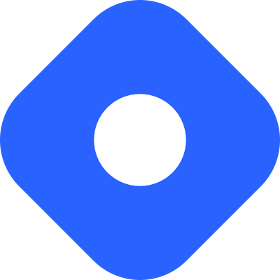
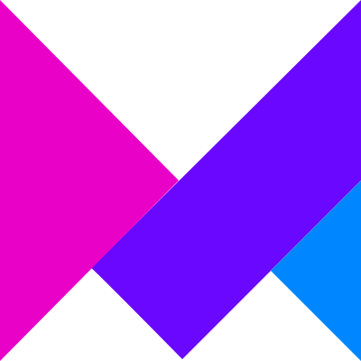
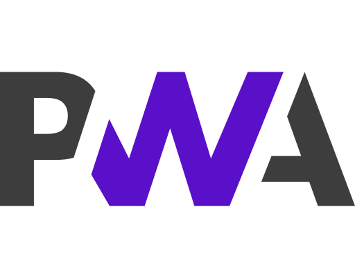
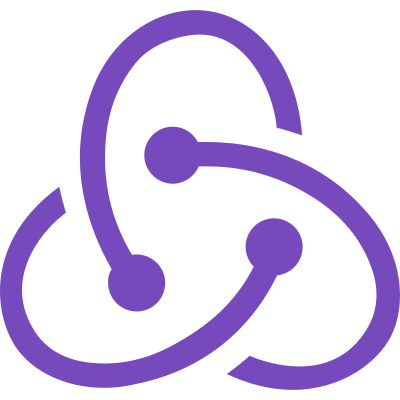
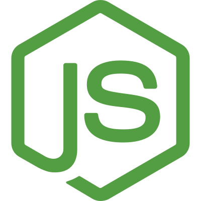
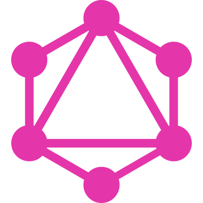
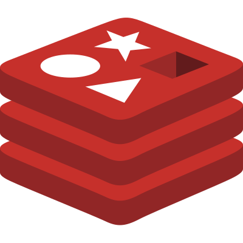
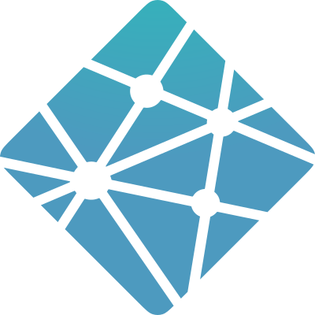
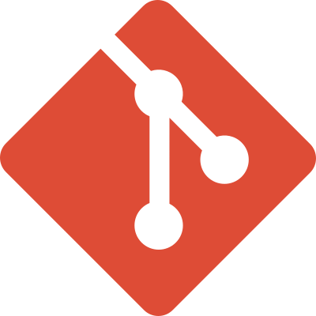
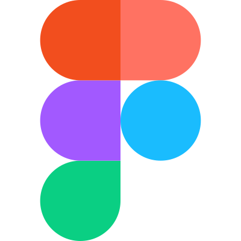

<!-- HEADING -->

# Hi 👋, I'm Mash Codee

#### An enthusiastic frontend-focused full-stack web developer from India

---

> ## Connect with me

 
 
 

> ## Tools and Technologies that I have used

<!-- BASIC -->

 
<!-- FRONTEND -->

 
<!-- BACKEND -->

 

<!-- DATABASES -->

 

<!-- HOSTING -->

 

<!-- TOOLS -->

 
 
 

> ## Projects

### 1. Chatsman - Feature-rich real-time chatting app (PWA)

**Live** - https://chatsman.vercel.app

**Tools & Technologies** - Next.js, Graphql, and Graphql subscription, Css, Apollo client, next-pwa, Google cloud storage bucket, Apollo server express, Bcrypt, Mongoose, Multer, MongoDB, Redis, JWT, Sendgrid, Heroku, Vercel.

**Features** - Online/Offline, Delete message, Slide message reply (reply to a specific message), Send images, Chat background, Profile (name, bio, username, profile picture), Block account, Delete chat, Manipulate user (update details, logout, delete account), Download the sent or received images, Last seen, Responsive to all devices.

**Description** - This was a solo project so everything from design to deployment of this project was done by me.

https://user-images.githubusercontent.com/50915748/140615207-0b07884c-7f47-458e-8840-0971edae3885.mp4

### 2. Goldencent - A beautiful static website for a company

**Live** - https://goldencent.vercel.app

**Tools & Technologies** - Html, TailwindCSS, Javascript, Vercel.

**Features** - Beautiful Timeline Section, Responsive to all devices, Good SEO, Optimized Images.

**Description** - This was a team project and in this project, I have worked with an agency called [Codegrain](https://codegra.in) and have learned how to do real-life paid projects with a team. In this project designing part was done by another guy and the entire development part was done by me.

https://user-images.githubusercontent.com/50915748/140620356-1cb9e086-1828-4f2f-b684-980397421422.mp4

 

> ## Stats

